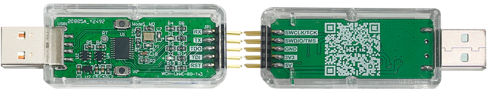
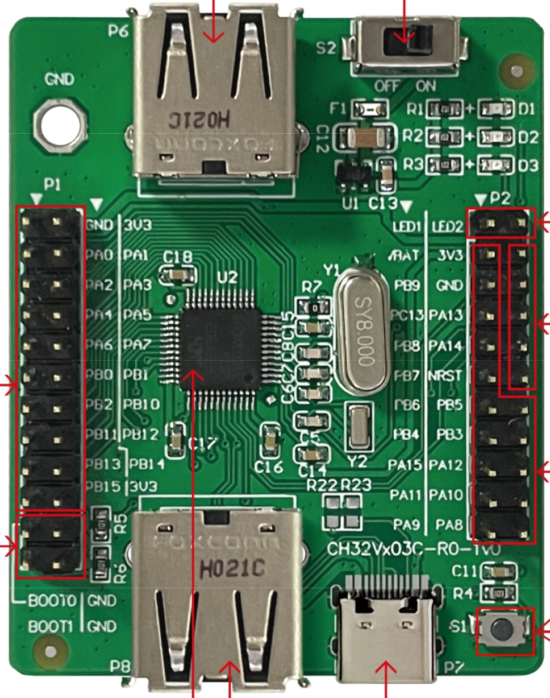

wch experiments

## WCH-Link



https://www.wch.cn/products/WCH-Link.html

```log
wmesg -w

[ 1223.228032] usb 1-9.2: new full-speed USB device number 14 using xhci_hcd
[ 1223.333465] usb 1-9.2: New USB device found, idVendor=1a86, idProduct=8010, bcdDevice= 2.07
[ 1223.333497] usb 1-9.2: New USB device strings: Mfr=1, Product=2, SerialNumber=3
[ 1223.333509] usb 1-9.2: Product: WCH-Link
[ 1223.333517] usb 1-9.2: Manufacturer: wch.cn
[ 1223.333524] usb 1-9.2: SerialNumber: 0001A0000000
[ 1223.355473] cdc_acm 1-9.2:1.1: ttyACM0: USB ACM device
```

# udev

```
sudo cp 49-wch-link.rules /etc/udev/rules.d/
sudo udevadm control --reload-rules && sudo udevadm trigger
```

## EVB

CH32Vx03C-R0-1v0



MCU: CH32V203C8T6

https://github.com/openwch/ch32v20x

| WCH-Link  | EVB   | MCU   |
|-----------|-------|-------|
| 3V3       | P2.4  | 3V3   |
| GND       | P2.6  | GND   |
| SWDIO     | P2.8  | PA13  |
| SWCLK     | P2.10 | PA14  |
| RST       | P2.12 | NRST  |

https://github.com/ch32-rs/wlink


```
cargo install --git https://github.com/ch32-rs/wlink
```

```
~/.cargo/bin/wlink status
```

* https://github.com/openwch/ch32v20x
* https://github.com/cnlohr/ch32v003fun

[ch32v20x.h](
https://github.com/openwch/ch32v20x/blob/main/EVT/EXAM/SRC/Peripheral/inc/ch32v20x.h)

## WebUSB

* https://github.com/webusb/awesome
* [Node WebUSB](https://github.com/node-usb/node-usb)
* https://docs.tinyusb.org

## Последовательность

1 Программ. ПРИЕМА на Flnb=739,550МГц. Нужен какой-то источник сигнала, например VNA.

https://qrz.by/forum/viewtopic.php?f=50&t=10526#p84253 уровень большой, можно спалить, лучше по эфиру, вставить скрепки, как антенны.


2 Панорама-водопад

3 Коррекция +9750,000МГц, чтобы вместо 739 550 показывал 10 489 550.
Freq=Flnb+9750000

4 Оцифровать ось Х на панораме 10489550, только последние 6 цифр.


Частота приема — маркер на оси, ширина задается в окне SSB Demodulator. Пока задать 3кГц.

5 Ввести LO от минус 200кГц до +50кГц, так «гуляют» LNB. Средний LO=0.
На экране движок и возможность ввода числа с точность 0,1кГц.

6 Разбить шкалу 10489,5 -10490,0 на 5 поддиапазонов:
- 10489,490 — 10489,610МГц,  нужен запас на краях примерно 10кГц, можно и другой,
- 10489,590 — 10489,710МГц,
- 10489,690 — 10489,810МГц,
- 10489,790 — 10489,910МГц,
- 10489,890 — 10490,010МГц.
Переключение ВВЕРХ/ВНИЗ парой кнопок на экране.

7 Программ. Передачи. Ftx=Feq-8089,5
На экране частоту передачи выводить числом: Ftx=F маркера приемника.

8 Экраны SSB Demodulator и SSB Modulator — только частоты звука Low cut и Hi cut.


