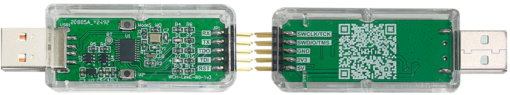
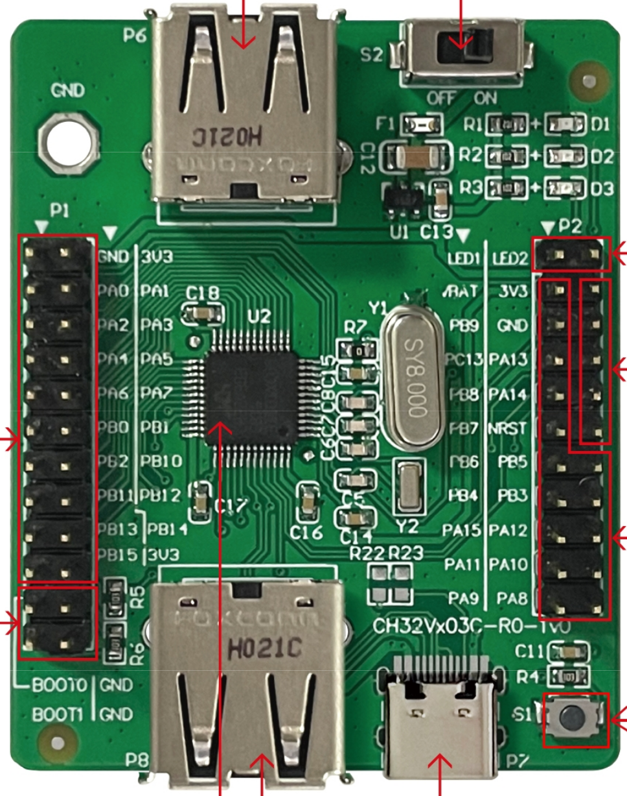
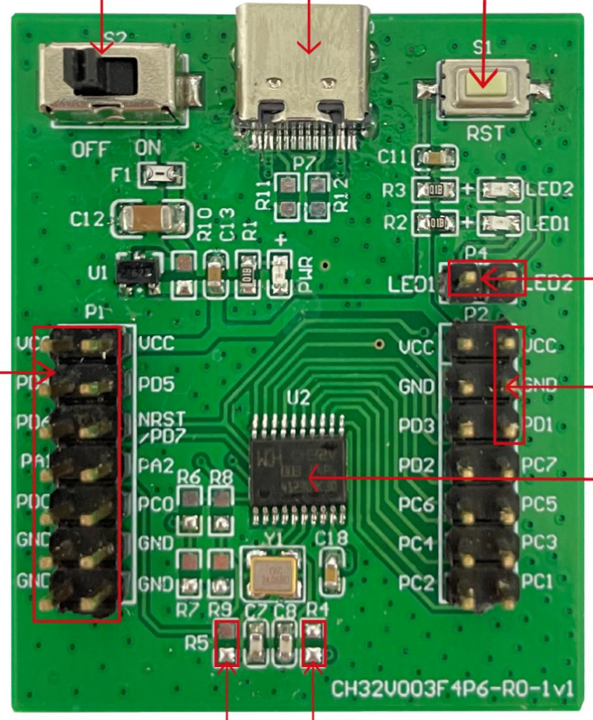
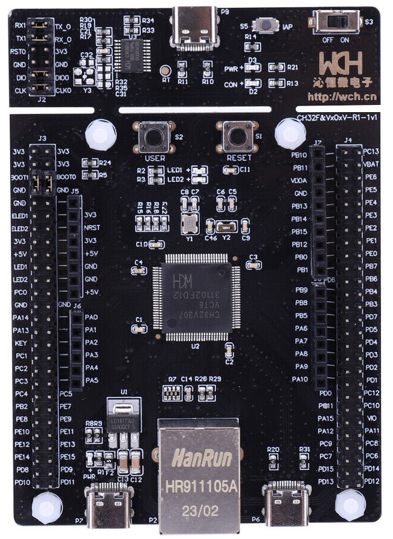

wch experiments

## WCH-Link



https://www.wch.cn/products/WCH-Link.html

```log
wmesg -w

[ 1223.228032] usb 1-9.2: new full-speed USB device number 14 using xhci_hcd
[ 1223.333465] usb 1-9.2: New USB device found, idVendor=1a86, idProduct=8010, bcdDevice= 2.07
[ 1223.333497] usb 1-9.2: New USB device strings: Mfr=1, Product=2, SerialNumber=3
[ 1223.333509] usb 1-9.2: Product: WCH-Link
[ 1223.333517] usb 1-9.2: Manufacturer: wch.cn
[ 1223.333524] usb 1-9.2: SerialNumber: 0001A0000000
[ 1223.355473] cdc_acm 1-9.2:1.1: ttyACM0: USB ACM device
```

## udev

```
sudo cp 49-wch-link.rules /etc/udev/rules.d/
sudo udevadm control --reload-rules && sudo udevadm trigger
```

## Programmer

https://github.com/ch32-rs/wlink


```
cargo install --git https://github.com/ch32-rs/wlink
```

```
~/.cargo/bin/wlink status
```


## CH32Vx03C-R0-1v0 Board



MCU: CH32V203C8T6

https://github.com/openwch/ch32v20x

| WCH-Link  | EVB   | MCU   |
|-----------|-------|-------|
| 3V3       | P2.4  | 3V3   |
| GND       | P2.6  | GND   |
| SWDIO     | P2.8  | PA13  |
| SWCLK     | P2.10 | PA14  |
| RST       | P2.12 | NRST  |

* https://github.com/openwch/ch32v20x
* [ch32v20x.h](
https://github.com/openwch/ch32v20x/blob/main/EVT/EXAM/SRC/Peripheral/inc/ch32v20x.h)

## CH32V003F4P6-R0-1v1 Board



MCU: CH32V003F4P6

| WCH-Link  | EVB   | MCU   |
|-----------|-------|-------|
| 3V3       | P2.2  | 3V3   |
| GND       | P2.4  | GND   |
| SWDIO     | P2.6  | PD1   |

## CH32V307EVB-R1 Board



MCU: CH32V307VCT6

Schematic: https://github.com/openwch/ch32v307/blob/main/EVT/PUB/CH32V30xSCH.pdf

P6: USB HS connector

* PB6: D-
* PB7: D+

Connect tor Goryn

|port|f1|f2|305|J3|J4|W|
|-|-|-|-|-|-|-|
|PD2  |         |SD_CMD |26 |   |36 | |
|PC12 |SPI3MOSI |SD_CK  |25 |   |40 | |
|PC11 |SPI3MISO1|SD_D3  |24 |   |41 | |
|PC10 |SPI3SCK1 |SD_D2  |23 |   |42 | |
|PA14 |SWCLK    |       |22 |27 |   | |
|PA13 |SWDIO    |       |19 |29 |   | |
|PC9  |         |SD_D1  |18 |   |47 | |
|PC8  |         |SD_D0  |17 |   |48 | |
|PB15 |SPI2MOSI |       |16 |   |13 | |
|PB14 |SPI2MISO |       |15 |   |11 | |
|PB13 |SPI2SCK  |       |14 |   |9  | |
|PB12 |SPI2NSS  |       |13 |   |15 | |
|PB11 |         |       |12 |   |3  | |
|PB10 |         |       |11 |   |1  | |
|PA7  |SPI1MOSI |       |10 |   |31 | |
|PA6  |SPI1MISO |       |9  |   |29 | |
|PA5  |SPI1SCK  |       |8  |38 |   | |
|PA4  |SPI1NSS  |       |7  |36 |   | |
|PC3  |         |       |5  |37 |   | |
|PC2  |         |       |4  |35 |   | |
|NRST |         |       |3  |   |   | |
|PD1  |         |       |2  |   |38 | |
|PD0  |         |       |1  |   |39 | |

### Connect to FT2232H

|port |f1       |WCH-J3 |color|FTD-J1 |port   |
|-----|---------|-------|-----|-------|-------|
|GND  |         |25     |blue |6      |       |
|PA14 |SWCLK    |27     |orng |7      |ADBUS0 |
|PA13 |SWDIO    |29     |red  |12     |ADBUS3 |


## CH32V317W-EVT-R0 Board

https://www.wch-ic.com/downloads/CH32V307DS0_PDF.html


### References

* https://github.com/cnlohr/ch32v003fun
* https://github.com/tvlad1234/linux-ch32v003

